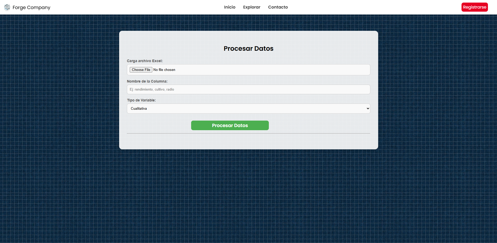
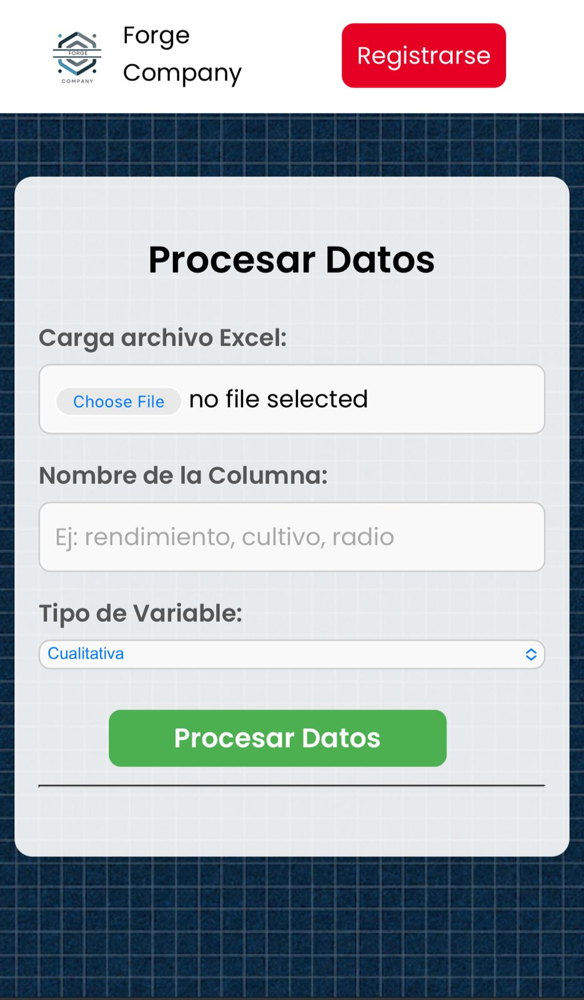

# 📊 DataViz Excel

[]()
[]()
[]()

---

## 🌟 Características Principales

✅ Carga de datos desde Excel (.xlsx) – Importa datos sin complicaciones.

✅ Cálculo automático de tablas de frecuencia – Distribución de frecuencias absolutas y relativas.

✅ Generación de gráficos dinámicos – Histogramas, gráficos de barras y diagramas de sectores.

✅ Interfaz intuitiva y amigable – Procesamiento rápido sin necesidad de conocimientos avanzados.

## ✅ Basado en tecnologías web – Sin necesidad de instalación de software adicional.

## 📷 Vistas

| 💻 Vista Escritorio                           | 📱 Vista Móvil                        |
| --------------------------------------------- | -------------------------------------- |
|  |  |

---

## 🛠️ Tecnologías Utilizadas

- **Frontend:** HTML, CSS, JavaScript.
- **Backend:** JavaScript.
- **Herramientas:** Git, VSCode.

---

## 🚀 Puedes usar online

1️⃣ Ingresar al link:

```bash
https://paultb3.github.io/app


```

